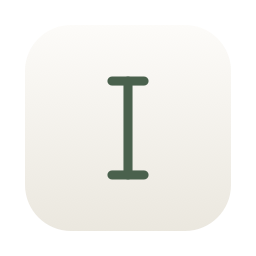
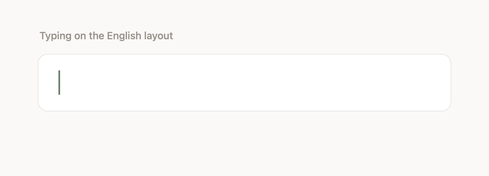

<a id="readme-top"></a>

<div align="center">



# Caret

**Fixes text typed on the wrong keyboard layout.**

Silent, native, and about as opinionated as a spell checker should be.

<a href="https://github.com/maksim-shabunov/caret/actions/workflows/ci.yml"></a>
<a href="https://github.com/maksim-shabunov/caret/releases/latest"></a>
<a href="https://github.com/maksim-shabunov/caret/releases"></a>


<a href="LICENSE"></a>

<a href="#installing"><b>Install</b></a> ·
<a href="#how-it-decides"><b>How it decides</b></a> ·
<a href="https://github.com/maksim-shabunov/caret/releases"><b>Releases</b></a> ·
<a href="https://github.com/maksim-shabunov/caret/issues/new?template=bug_report.yml"><b>Report a bug</b></a>

<br>



</div>

---

You meant to write `привет`, but the layout was still English, so you got
`ghbdtn`. Caret notices and fixes it before you do — no dialog, no confirmation,
no list of suggestions. The word is simply right by the time you have typed the
space after it.

Its one guiding rule is that a wrong correction is far more annoying than a
missed one, so it stays silent unless the evidence points one way only.

<details>
<summary><b>Table of contents</b></summary>

- [Installing](#installing)
  - [Updating](#updating)
- [Using it](#using-it)
- [Privacy](#privacy)
- [How it decides](#how-it-decides)
  - [When it stays silent](#when-it-stays-silent)
  - [Replacing the text](#replacing-the-text)
- [Known limitations](#known-limitations)
- [Building](#building)
- [Layout of the source](#layout-of-the-source)
- [Contributing](#contributing)
- [License](#license)

</details>

## Installing

Requires **macOS 15 or later**. Universal — Apple silicon and Intel.

```sh
brew install --cask maksim-shabunov/tap/caret
```

<details>
<summary>Without Homebrew</summary>

```sh
curl -fsSL https://raw.githubusercontent.com/maksim-shabunov/caret/main/install.sh | bash
```

It downloads the latest release, checks the published SHA-256, installs to
`/Applications`, and clears the quarantine flag. It is short, and worth reading
before you pipe it anywhere.

</details>

<details>
<summary>By hand, and why the scripts exist</summary>

Releases are signed, but *ad hoc*. Signing in the way Gatekeeper accepts without
complaint needs a paid Apple Developer account, which this project does not
have — so macOS flags the download and refuses to open it with "Apple could not
verify this app is free of malware".

Nothing about that is specific to Caret; it is what every unnotarised app gets.
If you take [the zip](https://github.com/maksim-shabunov/caret/releases/latest)
and move the app yourself, clear the flag:

```sh
xattr -dr com.apple.quarantine /Applications/Caret.app
```

That is exactly what the install script does, and what Homebrew's
`--no-quarantine` does. If you would rather not take anyone's word for any of
it, [build from source](#building) — a local build is never quarantined.

</details>

Homebrew will note that the tap is untrusted, because it is not an official one.
`brew trust --cask maksim-shabunov/tap/caret` vouches for it.

Caret asks for Accessibility permission on first launch. It is the only
permission it will ever ask for, and it needs it to see what you type and to put
the corrected word back.

### Updating

```sh
brew upgrade --cask caret
```

> [!IMPORTANT]
> **Accessibility permission does not survive an update of a downloaded build.**
> macOS records the grant against the app's signature, and an ad-hoc signature is
> the app's own contents — so every version signs differently. The old entry
> stays in the list, still ticked, granting nothing. Remove it with `−` and add
> the new Caret. Caret detects this and says so. Building from source avoids it,
> because your own signing identity does not change.

<p align="right"><a href="#readme-top">back to top ↑</a></p>

## Using it

| | |
| --- | --- |
| **Corrects as you type** | When a finished word is nonsense in the active layout and a real word in another installed one, Caret swaps it. Works in every app, because it types into whatever has focus rather than integrating with anything. |
| **⌘Z undoes it** | For five seconds after a correction — the reflex you already have. After that, or after clicking elsewhere, ⌥⌘Z still puts it back. Reverting also tells Caret never to offer that correction again this session, so undoing sticks. |
| **⌥⇧Space converts on demand** | The selection, or the word just typed if nothing is selected. Press again to cycle through the other layouts. The manual trigger skips every guard, because you asked. |

Settings has three things worth knowing about: which languages to watch and in
what order, how eagerly to act on words no dictionary knows, and which apps to
leave alone.

## Privacy

Nothing typed leaves your Mac. There is no network code in the project — no
analytics, no update check, nothing to turn off.

Caret holds the last thirty characters you typed, in memory, to tell which
language a sentence is in. That window is dropped when you switch app, switch
layout, click elsewhere, or pause for a minute. History is a list of
before/after pairs, kept in memory unless you turn on persistence in
Settings › Privacy, and never recorded at all while macOS reports secure input.

<p align="right"><a href="#readme-top">back to top ↑</a></p>

## How it decides

Four kinds of evidence, in descending order of how much Caret trusts them.

1. **A dictionary vouches for the conversion.** `z,km,rj` → `яблоко`, confirmed
   by Russian.
2. **Nothing can vouch for the destination, but the conversion cleans up
   punctuation.** `]un` → `õun`. macOS ships no Estonian dictionary, so structure
   stands in for a lexicon: a word full of brackets becoming a word full of
   letters is evidence in itself.
3. **No dictionary will ever help, so the letters are judged on shape.** Slang,
   typos and clipped forms all live in the pile a dictionary rejects; what
   separates them from noise is that they are built from ordinary syllables. A
   character model trained on the committed corpora scores both readings, and
   the conversion has to win by a wide margin.
4. **The word is one or two letters, and the sentence speaks for it.** A lone `z`
   in a Russian line was meant to be `я`. Nothing about the letter itself will
   ever say so.

Each layout is asked about its own primary language and no other. A layout
advertises every language it is *capable* of typing — ABC claims 96 — and among
them sit dictionaries permissive enough to accept any run of Latin letters at
all. Consult the whole list and something always says yes.

### When it stays silent

Every one of these is a case where a "fix" would be worse than doing nothing.

| Situation | Why |
| --- | --- |
| The word is real in a language you type | It might be exactly what you meant |
| The sentence around it is in that language, and it looks ordinary there | `IDE` in English prose is `IDE` |
| The key beside the one you hit spells a word | `remarkab;e` is `remarkable`, not Estonian |
| A possessive or contraction | `novum's`, `'ve` — the apostrophe is prose |
| Two layouts both look plausible | No way to pick, so neither |
| Fewer than three letters, punctuation aside | Too little signal (configurable, 2–8) |
| Contains a digit | Version, identifier, measurement, password |
| URL, email, `@mention`, path, `snake_case`, `camelCase` | Not prose |
| Typed with ⌘, ⌃ or ⌥ held | An instruction to the app |
| A word you already reverted | You said no once |
| An excluded app, or a secure input field | Off-limits by configuration or by macOS |
| The caret has moved since the last correction | Cannot delete what it cannot verify |

That last one is the invariant the code is built around. Caret only knows where
the insertion point is by remembering what it has seen since it last looked; a
click or a keystroke gives that up. Nothing that deletes text without first
reading it may run while the caret's position is unknown.

### Replacing the text

Two routes, tried in order.

1. **Accessibility.** Read the focused element, set a selection range, write the
   replacement. Atomic and invisible; used by most native apps.
2. **Synthesised keystrokes.** Backspace over the word and type the new one. The
   fallback for Terminal, Electron apps, and anything that will not expose its
   text. Only ever used when the caret is known to be exactly where Caret left it.

Synthesised events carry a marker in `eventSourceUserData`, so Caret does not
read its own typing back in as input.

<p align="right"><a href="#readme-top">back to top ↑</a></p>

## Known limitations

Written down rather than discovered by you.

| | |
| --- | --- |
| Two wrong keys in one word | `he;;o` becomes `heöo`. One wrong key is caught by looking at the key beside it; two is indistinguishable from a genuine Estonian double vowel like `k;;k` → `köök`. |
| The first word in a fresh app | Some corrections lean on knowing which language you have been writing in, and the window starts empty. Closing that gap by other means measured worse: it cost `ant`, `able` and `believe` to save `ide`. |
| Estonian is judged without a dictionary | macOS ships none, so Estonian rests on punctuation and shape alone. It is the weakest of the four kinds of evidence. |
| Only one keyboard layout at a time is active | Caret compares against every layout you have enabled, but it cannot know you *meant* to switch. |

## Building

Needs macOS 15 and a Swift 6.2 toolchain (Xcode 26 or the matching standalone
toolchain). No Xcode project — SwiftPM and a shell script.

```sh
git clone https://github.com/maksim-shabunov/caret.git
cd caret
./build.sh --install --run
```

```sh
./build.sh                 # release, universal, signed, into build/
./build.sh --fast --run    # this Mac's architecture only, then launch
./build.sh --adhoc --zip   # what a release builds
swift test                 # 215 tests, none of which need a keyboard
```

A local build is the better one to run day to day. `build.sh` signs with your
Apple Development identity — free with any Apple ID, and stable across rebuilds
— so Accessibility permission survives every rebuild. Without an identity it
falls back to ad hoc and says so.

App Sandbox is off, and has to be: a sandboxed process cannot hold a
`CGEventTap` or drive the Accessibility API, which are the two things Caret is
made of.

The generated assets are regenerated rather than hand-maintained:

```sh
swift Tools/MakeIcon.swift      # Resources/Caret.icns
swift Tools/HarvestWords.swift  # the character-model corpora
swift Tools/DumpLayouts.swift   # the keyboard layouts the tests use
swift Tools/MakeDemo.swift      # the images in this README
```

## Layout of the source

```
Sources/
  CaretCore/          Pure logic. No AppKit, no event tap, fully testable.
    Layouts/            Reading installed layouts; translating keystrokes
    Engine/             The typing buffer and the correction decision
    Text/               Lexicons, character models, script detection, guards
    Model/              Preferences, history, shortcuts, keystrokes
  Caret/              The app.
    System/             Event tap, Accessibility, replacement, undo, permissions
    UI/                 Menu bar, HUD, Settings, onboarding, design system
Tests/CaretCoreTests/
```

The split is the point: everything deciding *whether* to correct lives in
`CaretCore` and is tested without a keyboard. Everything touching the system
lives in `Caret` and is kept as thin as it can be. `CorrectionEngine` and
`CorrectionController` are the two files to read first.

<p align="right"><a href="#readme-top">back to top ↑</a></p>

## Contributing

Bug reports are the most useful thing you can send, and a good one is short:
what you typed, what Caret did, what you expected, and which layouts you have.

Before changing a correction rule, read [CONTRIBUTING.md](CONTRIBUTING.md) —
there is one house rule, which is to measure against the whole corpus rather
than a handful of examples. A shape-based rule that read convincingly on eight
hand-picked words turned out to cost 247 real corrections, and that is the sort
of thing only a sweep will tell you.

## License

MIT — see [LICENSE](LICENSE).

<p align="right"><a href="#readme-top">back to top ↑</a></p>
